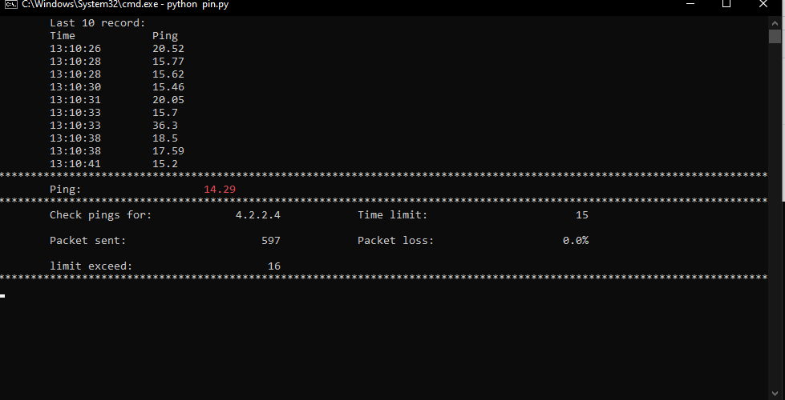

# Ping Observer

###### pings a specific IP and store timestamp of the exceeding ping and the ping

This script is usefull while u r gaming. 
It store the times that the ping has exceed the limit.

